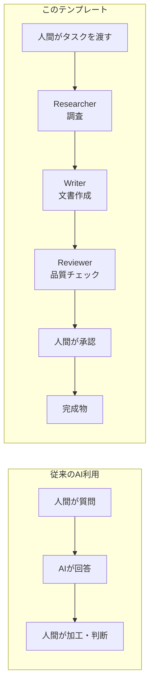
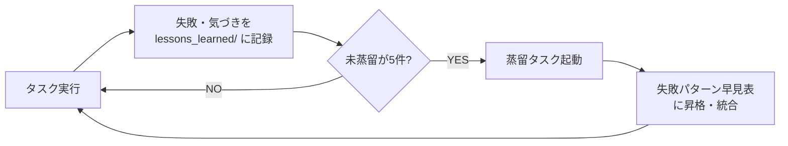
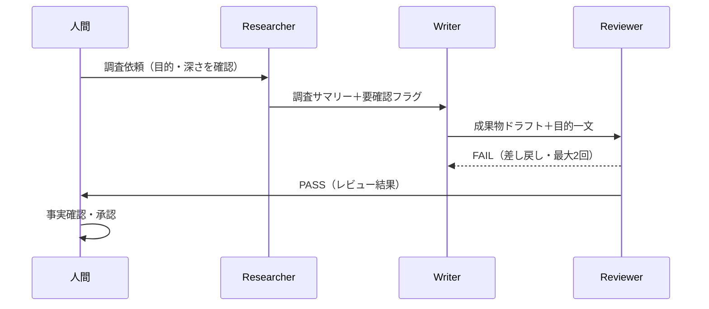
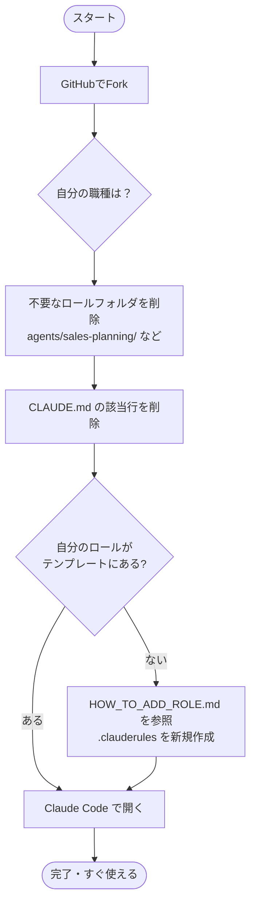
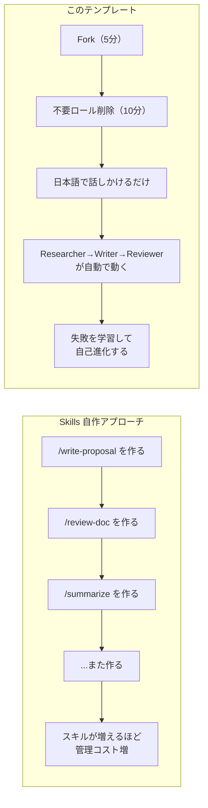
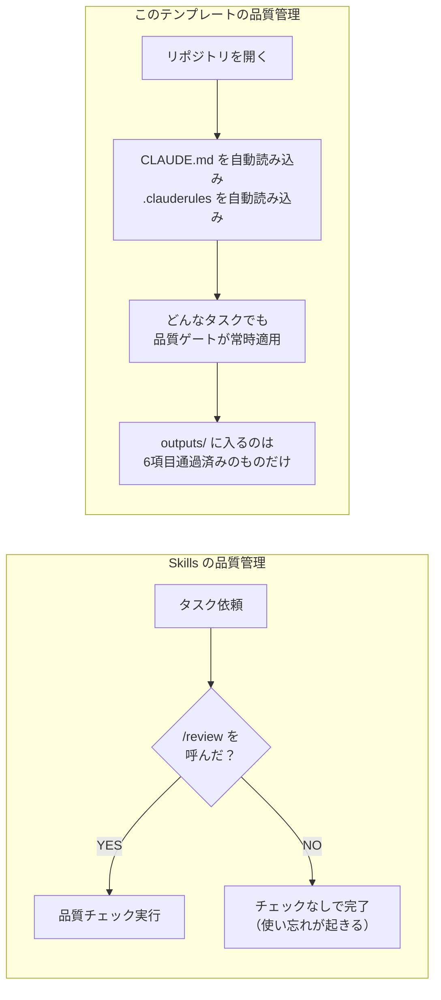

# AI Business OS — リポジトリ紹介まとめ
> 対象: 本リポジトリを fork して業務をAIエージェントベースに切り替えたい組織向け
> 作成日: 2026-05-11

---

## はじめに：AIエージェントって何？

**一言で言うと「仕事を頼める AI の部下」です。**

ChatGPT に質問して回答をもらう、という使い方は多くの人がしていると思います。AIエージェントはそれを一歩進めて、「調べる・書く・確認する」という**一連の業務プロセスを自律的にこなす**ように設計した AI の使い方です。

| 従来の AI の使い方 | AIエージェントの使い方 |
|---|---|
| 質問する → 答えをもらう | タスクを渡す → 計画・実行・成果物まで出てくる |
| 毎回ゼロから指示する | 失敗を学習して次回は改善される |
| 品質は人間が全部チェック | 品質ゲートを自動で通過してから人間に届く |



このリポジトリは、そのAIエージェントの仕組みを**エンジニアでなくても使えるように**パッケージ化したテンプレートです。

---

## わからなくなったらここで聞いてください

このドキュメントを読んでいて詰まったら、**Claude Code（このチャット画面）に日本語でそのまま質問してください。**

```
「.clauderules って何を書けばいいの？」
「plans/ フォルダに何をどう書けばいい？」
「このタスク、どのエージェントに頼めばいい？」
「WBSを作りたいんだけど、どこから始めればいい？」
```

Claude はこのリポジトリのルール（CLAUDE.md）を読んだ状態で答えます。ドキュメントをすべて理解してから動き始める必要はありません。**動きながら聞いて覚える**のが、このテンプレートの正しい使い方です。

また、「こういうルールで動いてほしい」と伝えれば、どのファイルに書けばいいかを判断して書き込みまでやります。ユーザーがファイルを直接編集する必要はありません。

> **重要:** 口頭で伝えるだけでなく、**ファイルに書き込んでもらうことが必須**です。セッションをまたいで記憶されるのはファイルだけです。これがAIエージェントの基本思想「記憶はファイルに持つ」です。

---

## 実際の会話例：初めてカスタマイズするとき

これは実際の導入時の会話例です。このように話しかけるだけで進められます。

---

**あなた:** カスタマイズってまずは何からやればいいの？

**Claude:** まず「自分の職種に関係ないロールフォルダを削除する」だけです。それだけで使い始められます。質問します。あなたの職種・役割は何ですか？

**あなた:** 業務設計・オペレーション

**Claude:** では、この手順でどうぞ。

削除するフォルダ（2つ）:
```
agents/sales-planning/
agents/pdm/
```
残すのはこの4つ:
```
agents/_researcher/     ← 残す（共通）
agents/_writer/         ← 残す（共通）
agents/_reviewer/       ← 残す（共通）
agents/business-design/ ← 残す（あなたのロール）
```
次に CLAUDE.md の該当行を2行削除するだけ。完了です。

---

**→ このように、職種を伝えるだけで「何を消して何を残すか」まで具体的に教えてもらえます。**

---

## 1. 設計思想

このテンプレートは「AIエージェントを業務の標準インフラ」として扱う設計思想で構築されています。

**3つのコア原則:**

| 原則 | 内容 |
|---|---|
| **計画先行** | 全タスクは `plans/` にファイルを作成してから実行。思考の記録を義務化 |
| **品質ゲート** | 6項目を満たすまで `outputs/` に入らない。AI生成物をそのまま使わせない |
| **自己進化** | 失敗パターンを `memories/lessons_learned/` に蓄積し、定期的にチームの知恵へ昇格 |

**優先順位の明文化:** `正確性 > 機密保護 > 読みやすさ > 速さ`

---

## 2. 実行フロー

```mermaid
flowchart TD
    Start([セッション開始]) --> Read[CLAUDE.md 読み込み\nAGENTS_COMMON.md\nagents/{ロール}/.clauderules]
    Read --> Protocol["タスク開始プロトコル（5ステップ）\n1. 目的を一文で明文化\n2. feature_list.json 確認\n3. 過去の失敗確認\n4. plans/ にファイル作成\n5. 機密情報を匿名化"]
    Protocol --> R[Researcher\n調査・情報収集]
    R -->|調査サマリー| W[Writer\n文書作成]
    W -->|成果物ドラフト| Rev[Reviewer\n品質チェック]
    Rev -->|FAIL| W
    Rev -->|PASS| Human[人間承認]
    Human --> Out[outputs/ へ移動]
    Out --> Complete["タスク完了プロトコル（8ステップ）\n結果記録・lessons_learned 更新\nfeature_list.json を COMPLETE に"]
```

---

## 3. 推しポイント

### モデルコスト最適化が内蔵されている

`SKILL_MODEL_MAP.json` で、タスクの重要度に応じてモデルを自動提案します。

| タスク | 推奨モデル | 理由 |
|---|---|---|
| 競合分析・事業戦略 | Opus | 誤りの影響が大きい |
| 提案書・仕様書作成 | Sonnet | コストと品質のバランス |
| 議事録要約・翻訳 | Haiku | 定型処理で十分 |

→ **「とりあえず全部 Opus」をやめて、コストを3〜5倍削減できます。**

### ロール設計で「コンテキスト汚染」を防ぐ

自分のロール以外の `agents/*/` は読まない設計。Researcher が Writer のルールで動く、という混乱が起きません。

### 失敗の自己進化サイクル



チームの失敗が次のセッションで予防策に変わります。

---

## 4. 実際の活用例：WBS作成から進捗管理まで

**シナリオ:** 新規プロジェクトのWBSを作り、週次で進捗を管理する

### Step 1: タスク開始（プロトコル実行）

```
あなた: 「新しい業務フロー整備プロジェクトのWBSを作りたい。
         対象は業務設計チーム5名、目的は月次レポート作成の工数を30%削減する」
```

Claudeが実行すること:
- `plans/2026-05-11-業務フロー整備WBS.md` を自動作成
- `feature_list.json` にタスクID `20260511-001` を登録
- `memories/lessons_learned/` から過去の失敗を参照

### Step 2〜4: エージェントパイプライン



### Step 5: 完成物を outputs/ へ

```
outputs/業務フロー整備WBS-2026-05-11.md
results/20260511-001-complete.json  ← used_model: "claude-sonnet-4-6"
```

### Step 6: 週次進捗管理

```
あなた: 「WBSの進捗を更新して。
         現状分析フェーズが1週間遅延しています」
```

- `feature_list.json` のステータスを自動更新
- 遅延の原因を `lessons_learned` に記録
- 次のセッションで同じ遅延パターンを予防

---

## 5. カスタマイズ手順

**所要時間: 30分以内**



### 手順1: Fork

GitHub の「Fork」ボタン → 自分のアカウントにコピー

### 手順2: 不要なロールを削除

自分の職種に関係ないフォルダを削除します。**職種が分からなければ Claude Code に聞けばどれを消すか教えてくれます。**

### 手順3: 自分のロールを追加（既存にない職種の場合）

`HOW_TO_ADD_ROLE.md` の手順で3ステップ:

```
1. agents/[ロール名]/.clauderules を作成
2. CLAUDE.md のエージェント構成に1行追記
3. templates/ に文書テンプレートを追加（任意）
```

`.clauderules` に書くのは3つだけ:
- この職種特有の判断基準
- よくある失敗パターンと対策
- 絶対にやってはいけないこと

ロール名の例: `hr`（人事）、`finance`（財務）、`marketing`（マーケ）、`legal`（法務）

### 手順4: Claude Code で開く

VSCode 拡張または `claude.ai/code` でリポジトリフォルダを開く。以上で完了。

---

## 6. 運用手順

### 日常運用（毎タスク）

```
1. タスクを日本語で伝える
2. Claudeが plans/ に計画を作成（確認・承認）
3. Researcher → Writer → Reviewer のパイプラインが動く
4. 品質ゲートを通過した成果物を受け取る
5. 人間が事実確認・承認してから外部利用
```

### ルールを育てる（随時）

```
「〇〇というルールで動いてほしい」と伝える
    ↓
Claude がどのファイルに書くか判断して書き込む
    ↓
次のセッションから自動的に反映される
```

### 月次運用

```
- memories/lessons_learned/ の未蒸留ファイルが5件に達したら蒸留タスクを実行
- 失敗パターン早見表を更新（Claudeが提案、人間が承認）
- feature_list.json で完了・進行中タスクを棚卸し
```

### 絶対守る4つのルール

| # | ルール | 理由 |
|---|---|---|
| 1 | AI生成の数値は人間が必ず確認 | 誤情報拡散の防止 |
| 2 | 外部送信前は人間が承認 | 機密漏洩・品質事故の防止 |
| 3 | 機密情報は匿名化してから渡す | 情報漏洩リスクの排除 |
| 4 | plans/ なしにタスクを開始しない | 引き継ぎ不能・方向性ずれの防止 |

---

## Skills（スラッシュコマンド）自作との違い

Claude には `/コマンド名` で呼び出せる Skills（カスタムスラッシュコマンド）を自作する機能があります。熱心に作り込んでいるメンバーもいるかもしれません。ただし、このテンプレートと比べると**用途と効率が根本的に違います。**



| 比較軸 | Skills 自作 | このテンプレート |
|---|---|---|
| **セットアップ** | コマンドごとに設計・作成が必要 | Fork して30分で完了 |
| **実行できること** | 単発のプロンプト実行 | 調査→作成→レビューの業務パイプライン |
| **品質管理** | なし（プロンプト次第） | 品質ゲート6項目が自動チェック |
| **チームへの展開** | 個人のスキル設計を共有・教育が必要 | リポジトリを Fork するだけ |
| **学習・進化** | スキルを手動で更新し続ける必要あり | 失敗パターンが自動蓄積・反映される |
| **記憶の引き継ぎ** | セッションをまたいで記憶されない | `memories/` にファイルとして永続化 |

**Skills が得意なのは「定型の単発作業を素早く呼び出す」こと。**
このテンプレートが得意なのは「業務プロセスそのものを AI に任せる」ことです。

Skills の自作に時間を使うより、このテンプレートを fork して30分でチーム全体の業務インフラを整えるほうが、圧倒的に投資対効果が高いです。

---

### よくある疑問：「なぜ Skills を設定しなくても品質管理が機能するの？」

Skills は「呼び出したときだけ動く」仕組みです。使い忘れたら品質チェックはゼロです。

このテンプレートの品質管理は仕組みが根本的に違います。**Claude がリポジトリを開いた瞬間に `CLAUDE.md` と `.clauderules` を自動で読み込み、ルールが常時適用された状態になります。** 呼び出し不要、設定不要、忘れようがありません。



| | Skills | このテンプレート |
|---|---|---|
| いつ動く？ | 呼び出したときだけ | 常時（セッション開始時に自動ロード） |
| 忘れたら？ | チェックなしで完了してしまう | 忘れようがない構造になっている |
| 品質の根拠 | プロンプトの書き方次第 | `CLAUDE.md` に明文化されたルールが全タスクに適用 |

---

### よくある疑問：「自作の Skills はこのテンプレートで使える？」

**使えます。** Skills とこのテンプレートは競合ではなく、組み合わせられる関係です。

Skills は `~/.claude/commands/` に置いたファイルが Claude Code に読み込まれる仕組みです。このフォルダはリポジトリの外にある個人フォルダなので、**どのリポジトリを開いていても常に有効**です。つまりこのテンプレートを開いた状態でも、自作の `/company-ppt` などはそのまま呼び出せます。

さらに `.clauderules` に「このステップでは `/company-ppt` を使う」と書けば、パイプラインの中で自動的に呼び出されます。

```
作ったSkillsが「いつ・どの順番で呼ばれるか」を
このテンプレートが管理してくれる
```

→ **既存の自作Skillsを捨てる必要はありません。むしろ今より賢く使われるようになります。**

### よくある疑問：「自作 Skills の修正は自分でファイルを編集しないといけない？」

いいえ。このチャット画面で「`/company-ppt` をこう修正して」と伝えるだけで、Claude がファイルを編集します。自分でファイルを開く必要はありません。作成・修正・削除、すべてここで指示できます。

具体的な指示でなくても構いません。「もっとカジュアルなトーンにしたい」「表形式で出してほしい」といった曖昧な要望でも、Claude が現在の Skill の内容を読んだ上で修正案を作って提示します。確認してから書き込むので、一方的に変えられることもありません。

---

## まとめ

このリポジトリは **「AIをツールとして使う」から「AIを業務インフラとして組み込む」** への転換を支援するテンプレートです。Fork して30分でスタートでき、運用しながら自組織の知識が自動で蓄積されていく設計になっています。MIT ライセンスのため商用利用・改変も自由です。
